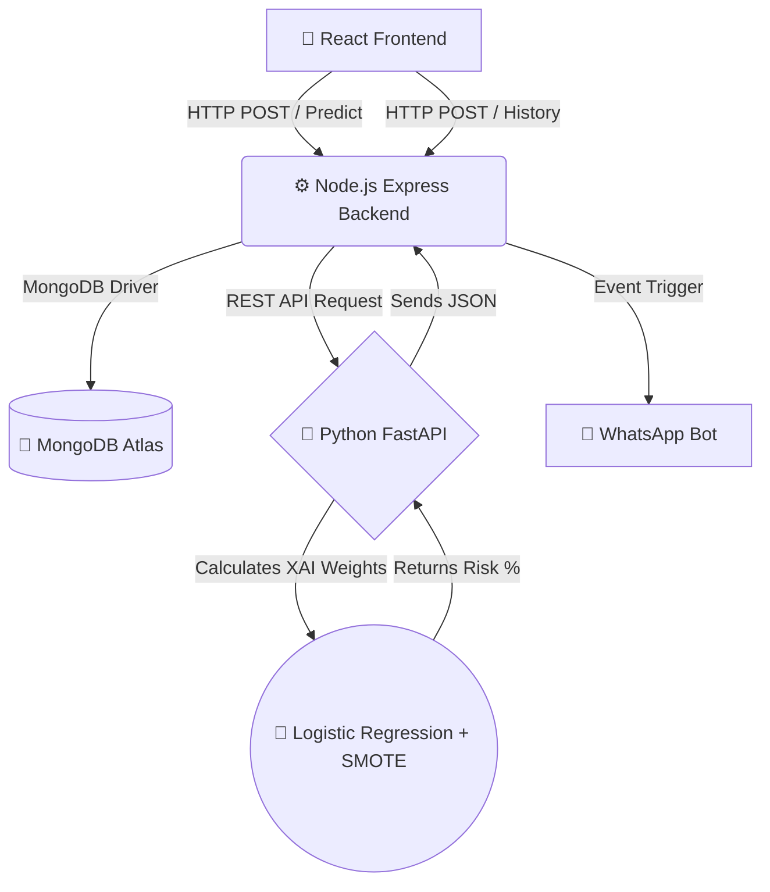

# 🩺 AI-Powered Diabetes Risk Predictor & Patient Portal

## 📖 Table of Contents
* Overview
* System Architecture
* Technology Stack & Versions
* Project Structure
* Prerequisites & Installation
* How to Run the Project
* How to Build the Desktop App (.exe)
* Test Cases
* Features
* API Documentation
* Troubleshooting
* License
* Acknowledgments

---

## 🎯 Overview
AI Health Risk Tracker is a full-stack, microservice-based medical diagnostic platform that predicts a patient's risk of developing diabetes using a Machine Learning model trained on 253,680 real patient records from the CDC's Behavioral Risk Factor Surveillance System (BRFSS).

When a high-risk score is detected (>50%), the system automatically dispatches a WhatsApp alert to the patient's phone number and logs the incident in a cloud database.

**Key Innovation: Explainable AI (XAI)**
Unlike typical black-box AI models, this system incorporates Logistic Regression with calibrated probability estimates, allowing medical professionals to interpret exactly which lifestyle factors (BMI, physical activity, diet, blood pressure) contributed to the risk score.

---

## 🏗️ System Architecture

## 🏗️ System Architecture

This project is decoupled into three primary microservices, ensuring scalability and efficient resource management:

Data Flow (Request Lifecycle)User fills health questionnaire in React UI.React sends POST /api/calculate-risk to Node.js Express server.Express forwards data to Python FastAPI at POST /predict-risk.Python runs the pre-trained Logistic Regression model and returns risk percentage.Express saves the result to MongoDB Atlas.If risk > 50%, Express triggers:WhatsApp alert via whatsapp-web.js headless browser.Email notification via Nodemailer (optional).Express returns final JSON to React, which renders an animated risk meter.💻 Technology Stack & VersionsLayerTechnologyVersionPurposeFrontendReact19.2.4UI frameworkVite8.0.4Build tool & dev serverElectron41.4.0Desktop app wrapperreact-router-dom7.14.1Client-side routingAxios1.15.0HTTP clientBackendNode.js22.x LTSJavaScript runtimeExpress4.21Web frameworkMongoose8.xMongoDB ODMwhatsapp-web.jsLatestWhatsApp automationNodemailerLatestEmail sendingdotenvLatestEnvironment variablesAI EnginePython3.14ML runtimeFastAPI0.115API frameworkUvicornLatestASGI serverscikit-learn1.8.0Machine learningpandas3.0.2Data manipulationnumpy2.4.4Numerical computingucimlrepo0.0.7Dataset fetcherDatabaseMongoDB Atlas8.0Cloud NoSQL databaseDatasetCDC BRFSS 2015ID: 891253,680 patient records📁 Project StructurePlaintextdiabities/
├── frontend/                    # React + Vite + Electron
│   ├── public/
│   │   └── app-icon.ico         # App icon for .exe
│   ├── src/
│   │   ├── App.jsx              # Main React component
│   │   ├── App.css              # Custom risk meter & blue/white theme
│   │   ├── main.jsx             # React entry point
│   │   └── index.css            # Global styles
│   ├── electron.cjs             # Electron main process
│   ├── vite.config.js           # Vite configuration
│   ├── package.json             # Dependencies & build scripts
│   └── index.html               # HTML template
│
├── backend/                     # Node.js + Express
│   ├── server.js                # Main backend server
│   ├── .env                     # Environment variables (DO NOT COMMIT)
│   ├── package.json             # Dependencies
│   └── node_modules/            # Installed packages
│
├── ml_api/                      # Python + FastAPI
│   ├── main.py                  # AI model & prediction endpoint
│   ├── venv/                    # Python virtual environment
│   └── requirements.txt         # Python dependencies
│
└── README.md                    # This file!
🚀 Prerequisites & InstallationSystem RequirementsOperating System: Windows 10/11 (64-bit)RAM: Minimum 8GB (16GB recommended)Storage: 2GB free spaceInternet: Required for initial dataset download & WhatsApp authentication1. Install Core TechnologiesNode.js v22.x LTS: Download from nodejs.orgPython 3.14: Download from python.org (⚠️ Check the box "Add Python to PATH" during installation)MongoDB Atlas: Create a free cluster at mongodb.com/atlas/database2. Python ML Microservice Setup (Terminal 1)PowerShell# Navigate to the ML API folder
cd "C:\Users\ss v\Desktop\diabities\ml_api"

# Create a virtual environment
python -m venv venv

# Activate the virtual environment
.\venv\Scripts\activate

# Install all required Python packages
pip install fastapi uvicorn scikit-learn pandas numpy ucimlrepo
3. Node.js Backend Setup (Terminal 2)PowerShell# Navigate to the backend folder
cd "C:\Users\ss v\Desktop\diabities\backend"

# Initialize and install dependencies
npm init -y
npm install express mongoose whatsapp-web.js qrcode-terminal nodemailer cors dotenv
4. React Frontend Setup (Terminal 3)PowerShell# Navigate to the frontend folder
cd "C:\Users\ss v\Desktop\diabities\frontend"

# Install all dependencies
npm install
5. MongoDB Atlas ConfigurationOpen backend/.env file (create it if it doesn't exist) and add your connection string:Code snippetMONGO_URI=mongodb+srv://<username>:<password>@cluster0.xxxxx.mongodb.net/health_tracker?retryWrites=true&w=majority
6. WhatsApp Bot AuthenticationWhen you first start the Node.js server, a QR code will appear in the terminal.Open WhatsApp on your phone.Tap the three dots (⋮) → "Linked Devices" → "Link a Device".Scan the QR code from your terminal.7. Environment Variables (.env)Create a backend/.env file with the following content:Code snippet# MongoDB Connection
MONGO_URI=mongodb+srv://<username>:<password>@cluster0.mongodb.net/health_tracker?retryWrites=true&w=majority

# Server Port
PORT=5000

# Gmail Credentials (optional)
GMAIL_USER=your_email@gmail.com
GMAIL_PASS=your16characterapppassword
GOVT_EMAIL=health_alert@example.com
⚠️ Important: Never commit your .env file to Git!🖥️ How to Run the ProjectYou need 3 separate terminal windows running simultaneously.Terminal 1: Python ML BrainPowerShellcd "C:\Users\ss v\Desktop\diabities\ml_api"
.\venv\Scripts\activate
uvicorn main:app
Terminal 2: Node.js Backend ServerPowerShellcd "C:\Users\ss v\Desktop\diabities\backend"
node server.js
Terminal 3: React FrontendPowerShellcd "C:\Users\ss v\Desktop\diabities\frontend"
npm run dev
Open your browser and go to: http://localhost:5173📦 How to Build the Desktop App (.exe)PowerShellcd "C:\Users\ss v\Desktop\diabities\frontend"
npm run build-exe
The output will be located in: frontend/release/AI Health Tracker Setup 1.0.0.exe🧪 Test CasesTest CaseAgeBMIHigh BPExerciseFruitsVeggiesExpected RiskAlert?Healthy Young2522.0NoYesYesYes<20%❌ NoModerate Adult4528.0NoNoNoYes25-40%❌ NoHigh Risk Senior8060.0YesNoNoNo>50%✅ YesExtreme Case90120.0YesNoNoNo>60%✅ Yes✨ Features✅ Real-time Diabetes Risk Prediction using CDC-trained ML model✅ WhatsApp Alert System for high-risk patients (>50% threshold)✅ MongoDB Database for patient record storage🎨 Blue & White Medical Theme with a Custom Animated Risk Meter🏗️ Microservice Architecture (3 independent services)📦 Desktop App Packaging (Electron .exe build)📡 API DocumentationPython FastAPI Endpoint (POST /predict-risk)Request Body:JSON{
  "phone": "9876543210",
  "age": 45,
  "bmi": 28.5,
  "high_bp": 1,
  "phys_activity": 0,
  "fruits": 1,
  "veggies": 0
}
Response:JSON{
  "risk_percentage": 42.35
}
🔧 TroubleshootingErrorCauseSolutionModuleNotFoundError: No module named 'ucimlrepo'Python package missingRun pip install ucimlrepo in the venvuvicorn is not recognizedVenv not activatedRun .\venv\Scripts\activate firstMongoDB Connection ErrorIP not whitelistedCheck .env and Atlas IP allowlistWhatsApp QR code not showingCache issueDelete .wwebjs_auth folder and restartElectron build failsMissing iconCreate public/app-icon.icoPort Already in Use?PowerShellnetstat -ano | findstr :5000
taskkill /PID [PID_NUMBER] /F
👨‍💻 Project ContributorsNameRoleGitHubRishabh TiwariFull-Stack Developer & AI Engineer@Rishabh-022🎓 Project StatusThis project was developed as a B.Tech Major Project demonstrating proficiency in Full-Stack Web Development (MERN Stack), Machine Learning, Microservice Architecture, API Integration, and Application Packaging.