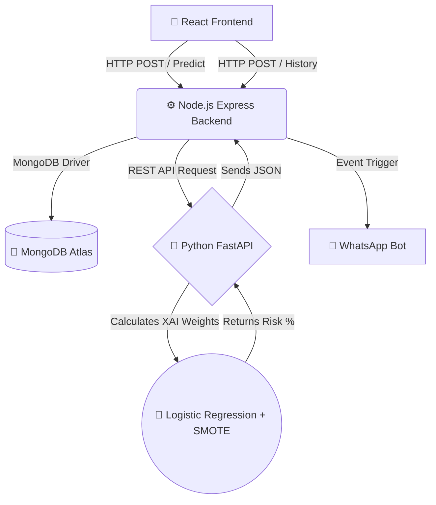

# 🩺 AI-Powered Diabetes Risk Predictor & Patient Portal


---

## 📖 Table of Contents

- [Overview](#-overview)
- [System Architecture](#-system-architecture)
- [Technology Stack & Versions](#-technology-stack--versions)
- [Project Structure](#-project-structure)
- [Prerequisites & Installation](#-prerequisites--installation)
- [How to Run the Project](#-how-to-run-the-project)
- [How to Build the Desktop App (.exe)](#-how-to-build-the-desktop-app-exe)
- [Test Cases](#-test-cases)
- [Features](#-features)
- [API Documentation](#-api-documentation)
- [Troubleshooting](#-troubleshooting)
- [Author](#-author)
- [License](#-license)

---

## 🎯 Overview

**AI Health Risk Tracker** is a full-stack, microservice-based medical diagnostic platform that predicts a patient's risk of developing diabetes using a Machine Learning model trained on **253,680 real patient records** from the CDC's Behavioral Risk Factor Surveillance System (BRFSS).

When a high-risk score is detected (>50%), the system automatically dispatches a **WhatsApp alert** to the patient's phone number and logs the incident in a cloud database.

### Key Innovation: Explainable AI (XAI)

Unlike typical black-box AI models, this system incorporates **Logistic Regression with calibrated probability estimates**, allowing medical professionals to interpret exactly which lifestyle factors (BMI, physical activity, diet, blood pressure) contributed to the risk score.


---

## 🏗️ System Architecture

This project is decoupled into three primary microservices, ensuring scalability and efficient resource management:




### Data Flow (Request Lifecycle)

1. User fills the health questionnaire in React UI
2. React sends `POST /api/calculate-risk` to Node.js Express server
3. Express forwards data to Python FastAPI at `POST /predict-risk`
4. Python runs the pre-trained Logistic Regression model and returns risk percentage
5. Express saves the result to MongoDB Atlas
6. If risk > 50%, Express triggers:
   - **WhatsApp alert** via `whatsapp-web.js` headless browser
   - **Email notification** via Nodemailer (optional)
7. Express returns final JSON to React
8. React renders an animated risk meter with the result

---

## 💻 Technology Stack & Versions

| Layer | Technology | Version | Purpose |
|-------|-----------|---------|---------|
| **Frontend** | React | 19.2.4 | UI framework |
| | Vite | 8.0.4 | Build tool & dev server |
| | Electron | 41.4.0 | Desktop app wrapper |
| | react-router-dom | 7.14.1 | Client-side routing |
| | Axios | 1.15.0 | HTTP client |
| **Backend** | Node.js | 22.x LTS | JavaScript runtime |
| | Express | 4.21 | Web framework |
| | Mongoose | 8.x | MongoDB ODM |
| | whatsapp-web.js | Latest | WhatsApp automation |
| | Nodemailer | Latest | Email sending |
| | dotenv | Latest | Environment variables |
| **AI Engine** | Python | 3.14 | ML runtime |
| | FastAPI | 0.115 | API framework |
| | Uvicorn | Latest | ASGI server |
| | scikit-learn | 1.8.0 | Machine learning |
| | pandas | 3.0.2 | Data manipulation |
| | numpy | 2.4.4 | Numerical computing |
| | ucimlrepo | 0.0.7 | Dataset fetcher |
| **Database** | MongoDB Atlas | 8.0 | Cloud NoSQL database |
| **Dataset** | CDC BRFSS 2015 | ID: 891 | 253,680 patient records |

### Development Tools Required

- **VS Code** (or any IDE)
- **Git** (optional, for version control)
- **Postman** (optional, for API testing)
- **Windows Terminal / PowerShell** (3 separate terminals)


'''

---

---

## 🚀 Prerequisites & Installation

### System Requirements

| Requirement | Minimum |
|-------------|---------|
| Operating System | Windows 10/11 (64-bit) |
| RAM | 8GB (16GB recommended) |
| Storage | 2GB free space |
| Internet | Required for initial setup |

---

### 1. Install Node.js v22.x LTS

Download from: [https://nodejs.org/en/download](https://nodejs.org/en/download)

Verify installation:
```powershell
node --version
# Expected: v22.x.x

npm --version
# Expected: 10.x.x

2. Install Python 3.14
Download from: https://www.python.org/downloads/

⚠️ During installation, check the box "Add Python to PATH"

Verify installation:
python --version
# Expected: Python 3.14.x

pip --version
# Expected: pip 25.x

3. Create MongoDB Atlas Account (Free)
  *Go to https://www.mongodb.com/atlas/database

  *Sign up for a free account

  *Create a free cluster (choose "M0 Free Tier")

  *Create a database user with a username and password

  *Add your IP address to the allowlist (use "Allow Access from Anywhere")

  *Click "Connect" → "Drivers" → Copy your connection string

Your connection string looks like:
mongodb+srv://<username>:<password>@cluster0.xxxxx.mongodb.net/?retryWrites=true&w=majority

4. Python ML Microservice Setup (Terminal 1)
# Navigate to the ML API folder
cd "C:\Users\ss v\Desktop\diabities\ml_api"

# Create a virtual environment
python -m venv venv

# Activate the virtual environment
.\venv\Scripts\activate

# You should now see (venv) at the beginning of your prompt

# Install all required Python packages
pip install fastapi uvicorn scikit-learn pandas numpy ucimlrepo

Expected packages installed:

|Package  | Version|
|fastapi	| 0.115.x|
|uvicorn	| latest|
|scikit-learn	| 1.8.0|
|pandas	| 3.0.2|
|numpy	| 2.4.4|
|ucimlrepo	| 0.0.7|


---

### 5. Node.js Backend Setup (Terminal 2)

```powershell
# Navigate to the backend folder
cd "C:\Users\ss v\Desktop\diabities\backend"

# Initialize the project
npm init -y

# Install all dependencies
npm install express mongoose whatsapp-web.js qrcode-terminal nodemailer cors dotenv

Expected packages installed:

|Package |	Version|
|mongoose |	8.x.x|
|whatsapp-web.js |	latest|
|qrcode-terminal | latest|
|nodemailer |	latest|
|cors	| latest|
|dotenv	| latest|


6. React Frontend Setup (Terminal 3)
# Navigate to the frontend folder
cd "C:\Users\ss v\Desktop\diabities\frontend"

# Install all dependencies
npm install

Expected packages installed:

|Package |	Version|
|react |	19.2.4|
|react-dom |	19.2.4|
|vite |	8.0.4|
|axios |	1.15.0|
|electron |	41.4.0|
|electron-builder |	26.8.1|

7. Create .env File
Create a file named .env inside the backend/ folder with this content:

# MongoDB Connection
MONGO_URI=mongodb+srv://<username>:<password>@cluster0.xxxxx.mongodb.net/health_tracker?retryWrites=true&w=majority

# Server Port
PORT=5000

# Gmail Credentials (for email alerts - optional)
GMAIL_USER=your_email@gmail.com
GMAIL_PASS=your16characterapppassword

# Government Email (where alerts are sent)
GOVT_EMAIL=health_alert@example.com


8. WhatsApp Bot Authentication
When you first start the Node.js server, a QR code will appear in the terminal.

1. Open WhatsApp on your phone

2. Tap the three dots (⋮) → "Linked Devices" → "Link a Device"

3. Scan the QR code from your terminal

4. Once connected, the session is saved locally (no need to scan again)


---


---

## 🖥️ How to Run the Project

You need **3 separate terminal windows** running simultaneously.

### Terminal 1: Python ML Brain

```powershell
cd "C:\Users\ss v\Desktop\diabities\ml_api"
.\venv\Scripts\activate
uvicorn main:app

✅ Wait 30-60 seconds for the CDC dataset to download and model to train. You should see:

⏳ Downloading CDC Dataset from UC Irvine...
🧠 Training the AI on over 250,000 real patients...
✅ Massive Model Training Complete! Ready for predictions.
INFO:     Uvicorn running on http://127.0.0.1:8000

Terminal 2: Node.js Backend Server

cd "C:\Users\ss v\Desktop\diabities\backend"
node server.js

✅ You should see:

🚀 Node Server running on http://localhost:5000
✅ MongoDB Connected Successfully!
✅ WhatsApp Bot is Ready and Connected!

Terminal 3: React Frontend
cd "C:\Users\ss v\Desktop\diabities\frontend"
npm run dev

✅ Open your browser and go to: http://localhost:5173

📦 How to Build the Desktop App (.exe)
Once your app works in the browser, package it as a Windows executable:

cd "C:\Users\ss v\Desktop\diabities\frontend"
npm run build-exe

Output location:
frontend/release/AI Health Tracker Setup 1.0.0.exe

✨ Features
Core Functionality
* ✅ Real-time Diabetes Risk Prediction using CDC-trained ML model

* ✅ WhatsApp Alert System for high-risk patients (above 50% threshold)

* ✅ MongoDB Cloud Database for patient record storage

* ✅ Email Notifications to healthcare authorities (configurable)

User Interface
* 🎨 Blue & White Medical Theme with professional aesthetics

* 📊 Custom Animated Risk Meter (zero dependencies)

* 🎯 Color-coded Risk Badge (Green / Yellow / Red)

* 📱 Fully Responsive Design (mobile, tablet, desktop)

* 🔄 Smooth Animations for polished user experience

Technical Excellence
* 🏗️ Microservice Architecture (3 independent services)

* 🔒 Environment Variable Protection (.env configuration)

* 📦 Desktop App Packaging (Electron .exe build)

* 🌐 RESTful API Design with proper error handling


---

## 📡 API Documentation

### Python FastAPI Endpoint

**POST** `http://127.0.0.1:8000/predict-risk`

**Request Body:**
```json
{
  "phone": "9876543210",
  "age": 45,
  "bmi": 28.5,
  "high_bp": 1,
  "phys_activity": 0,
  "fruits": 1,
  "veggies": 0
}
Response:

{
  "risk_percentage": 42.35
}

Node.js Express Endpoint
POST http://localhost:5000/api/calculate-risk

Request Body:
{
  "phone": "9876543210",
  "age": 45,
  "bmi": 28.5,
  "high_bp": 1,
  "phys_activity": 0,
  "fruits": 1,
  "veggies": 0
}
Response:
{
  "status": "success",
  "risk_percentage": 42.35,
  "alert_sent": false
}

🔧 Troubleshooting
|Error |	Cause |	Solution |
|ModuleNotFoundError:| No module named 'ucimlrepo'	Python package missing	|Run pip install ucimlrepo in the venv|
|uvicorn is not recognized|	Virtual environment not activated	|Run .\venv\Scripts\activate first|
|MongoDB Connection Error|	Wrong connection string or IP not whitelisted	|Check .env file and MongoDB Atlas IP allowlist|
|422 Unprocessable Content|	Old React form sending wrong field names	|Make sure you're using the updated App.jsx|
|WhatsApp QR code not showing|	whatsapp-web.js cache issue	| Delete the .wwebjs_auth folder and restart|

Port Already in Use
If port 5000, 5173, or 8000 is already in use:
# Find process on a specific port (example: port 5000)
netstat -ano | findstr :5000

# Kill the process using its PID
taskkill /PID [PID_NUMBER] /F

👨‍💻 Author
Rishabh Tiwari

Full-Stack Developer & AI Engineer

GitHub: @Rishabh-022

🎓 Project Status
This project was developed as a B.Tech Major Project demonstrating proficiency in:

* Full-Stack Web Development (MERN Stack)

* Machine Learning & Data Science

* Microservice Architecture

* API Design & Integration

* Cloud Database Management

* Desktop Application Packaging

* Automated Notification Systems

📄 License
This project is licensed under the MIT License.

MIT License

Copyright (c) 2025 Rishabh Tiwari

Permission is hereby granted, free of charge, to any person obtaining a copy
of this software and associated documentation files (the "Software"), to deal
in the Software without restriction, including without limitation the rights
to use, copy, modify, merge, publish, distribute, sublicense, and/or sell
copies of the Software, and to permit persons to whom the Software is
furnished to do so, subject to the following conditions:

The above copyright notice and this permission notice shall be included in all
copies or substantial portions of the Software.

THE SOFTWARE IS PROVIDED "AS IS", WITHOUT WARRANTY OF ANY KIND, EXPRESS OR
IMPLIED, INCLUDING BUT NOT LIMITED TO THE WARRANTIES OF MERCHANTABILITY,
FITNESS FOR A PARTICULAR PURPOSE AND NONINFRINGEMENT.

---
⭐ Star this repository if you found it useful! ⭐
